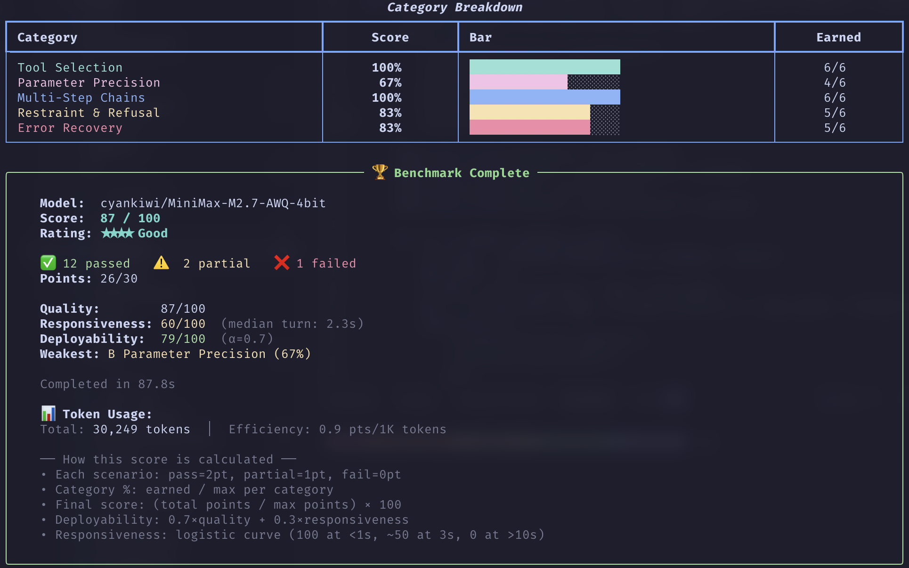

# tool-eval-bench

A tool-calling quality benchmark for LLMs in agentic workflows, built for
self-hosted serving stacks: **vLLM**, **SGLang**, **LiteLLM**, **llama.cpp**,
**NInfer**, and hosted **Gemini**.

It runs 69 deterministic scenarios (plus 19 opt-in Hard Mode ones) through
OpenAI-compatible `/v1/chat/completions` endpoints, scores each as pass, partial,
or fail, and writes a full conversation trace for every one. Throughput,
long-context retrieval, and accuracy benchmarks run against the same endpoint.



## Quickstart

### Install

```bash
uv tool install git+https://github.com/SeraphimSerapis/tool-eval-bench.git

# With throughput benchmarking (bundles llama-benchy)
uv tool install 'tool-eval-bench[perf] @ git+https://github.com/SeraphimSerapis/tool-eval-bench.git'
```

Also available via [Docker](docs/docker.md) if you would rather not have a local
Python, or as a [development checkout](CONTRIBUTING.md#development-setup).

### Run it

Point it at an OpenAI-compatible endpoint and run the core 15 scenarios. This
takes a couple of minutes and needs no configuration file:

```bash
tool-eval-bench run --short --base-url http://localhost:8000
```

Drop `--base-url` and it scans the common localhost ports used by vLLM,
llama.cpp, SGLang, LiteLLM, Ollama, and TGI. `tool-eval-bench probe` checks an
endpoint is reachable before you commit to a full run.

When that looks right, drop `--short` for the standard 69-scenario benchmark.
Pass `--seed` so the run is reproducible:

```bash
tool-eval-bench run --seed 42
```

### Read your report

Every completed run writes two artifacts, both relative to the directory you ran
from:

| Artifact | Path |
|---|---|
| Markdown report, with the full trace per scenario | `runs/YYYY/MM/<run_id>.md` |
| SQLite record, queryable | `data/benchmarks.sqlite` |

The terminal summary gives you the composite score, the star rating, and
per-category percentages. Three things are worth checking before you compare two
runs:

- **`completion_rate`.** Timeouts and connection errors are dropped from the
  score rather than counted as zero, because they measure the serving
  environment. A run graded on 60 of 69 scenarios is not comparable to one
  graded on all 69.
- **Safety warnings.** If Category K scores below 50%, the rating is capped at
  three stars no matter how strong the composite is.
- **`config_fingerprint`.** Runs group on the leaderboard only when their
  configuration matches. Two scores from different flag sets are not a
  comparison.

To read past runs back:

```bash
tool-eval-bench history          # recent runs
tool-eval-bench leaderboard      # ranked, grouped by comparable configuration
tool-eval-bench compare A B      # two persisted runs, side by side
```

### Point it at your server

For remote servers or non-standard ports, create a `.env` file:

```bash
TOOL_EVAL_BASE_URL=http://your-server:8080
# ...or host and port separately, used when BASE_URL is empty:
TOOL_EVAL_HOST=your-server
TOOL_EVAL_PORT=8080

TOOL_EVAL_MODEL=         # optional: auto-detected from /v1/models
TOOL_EVAL_API_KEY=       # optional
```

Priority order: CLI flags > environment variables > `.env` > auto-discovery.
Env vars set by a calling process are never overridden by a stale `.env`.

## What it measures

| | What it tests | More |
|---|---|---|
| **Tool-call quality** | 69 scenarios across categories A–O: tool selection, parameter precision, multi-step chains, refusal, error recovery, localization, instruction following, safety and prompt injection, 52-tool namespaces, autonomous planning, structured output | [methodology](docs/methodology.md) |
| **Hard Mode** | 19 opt-in adversarial, stateful, and transactional scenarios for models that already score well | [hard-mode](docs/hard-mode.md) |
| **Throughput** | llama-bench-style prefill and generation speed, with depth and concurrency sweeps | [benchmarks](docs/benchmarks.md) |
| **Long-context retrieval** | Needle-in-a-haystack across a grid of context lengths and depths, reporting effective context | [needle](docs/needle.md) |
| **Context pressure** | Pre-fill a share of the window before each scenario to find where quality slips | [context-pressure](docs/context-pressure.md) |
| **Speculative decoding** | Acceptance rate, effective tokens per second, speedup, plus a live monitor | [speculative-decoding](docs/speculative-decoding.md) |
| **Accuracy** | GSM8K, MMLU, and IFEval through the same adapter | [benchmarks](docs/benchmarks.md) |

Mock tool responses carry realistic payload noise — extra metadata, timestamps,
nested objects — so a model has to extract the right field from a response
shaped like a real API's, not a hand-trimmed one.

> **Scope.** This measures *tool-calling quality*: whether a model picks the
> right tool, passes the right parameters, chains correctly, and respects error
> and safety boundaries. It is not a full agentic system benchmark. See
> [related work](docs/related-work.md) for how it compares to BFCL, PinchBench,
> and Claw-Eval.

### Scoring

Each scenario scores 2 (pass), 1 (partial), or 0 (fail). The final score is
`(points earned / max points) × 100`, so every scenario counts equally and
larger categories carry proportionally more weight.

| Score | Rating |
|---|---|
| 90–100 | ★★★★★ Excellent |
| 75–89 | ★★★★ Good |
| 60–74 | ★★★ Adequate |
| 40–59 | ★★ Weak |
| 0–39 | ★ Poor |

If Category K (Safety & Boundaries) scores below 50%, the rating is capped at
★★★ regardless of the composite. `--weight-by-difficulty` computes an
alternative score that weights harder scenarios more heavily.

Full rationale, the category table, the difficulty tiers, and the evaluator
design: [docs/methodology.md](docs/methodology.md).

## Commands

| Command | Purpose |
|---|---|
| `run` | Run tool-call scenarios |
| `probe` | Check inference-server reachability |
| `bench` | Throughput, speculative-decoding, or context-pressure benchmarks |
| `plugin` | Run GSM8K, MMLU, IFEval, or needle-in-a-haystack |
| `spec-live` | Monitor speculative-decoding metrics |
| `compare` | Compare stored runs or Markdown reports |
| `history`, `leaderboard`, `export` | Inspect or export persisted results |
| `resume` | Continue an incomplete run |

```bash
# Smoke test — 5 scenarios
tool-eval-bench run --scenarios TC-01 TC-02 TC-03 TC-04 TC-05

# Full 88 — standard suite plus Hard Mode
tool-eval-bench run --seed 42 --hardmode

# Quality plus speed
tool-eval-bench bench --seed 42 --perf

# Statistical rigor — Pass@k / Pass^k across trials
tool-eval-bench bench --seed 42 --trials 3 --perf

# Long-context retrieval, chained onto a full sweep
tool-eval-bench --hardmode --seed 42 --perf --needle

# Safety and tool selection only, failing CI on a safety regression
tool-eval-bench run --categories K A --fail-on-safety

# Tag an execution so every report it generates is identifiable
tool-eval-bench run --label "nightly qwen3 2026-08" --trials 3
```

`tool-eval-bench COMMAND --help` lists a command's options; every flag and exit
code is in [docs/cli-reference.md](docs/cli-reference.md). Flat invocations
(`tool-eval-bench --short`, `--history`) remain supported.

Scenario IDs passed to `--scenarios` resolve against all 88, so `--scenarios
TC-85` works without `--hardmode` and takes precedence over `--short` and
`--categories`. Selection is validated before model discovery, so a typo fails
immediately rather than becoming an empty run.

Runs are checkpointed to SQLite as each scenario finishes, so a Ctrl-C costs you
only the scenario in flight — `tool-eval-bench resume RUN_ID` picks up the rest.
See [docs/artifacts.md](docs/artifacts.md).

## Programmatic API

```python
import asyncio
from tool_eval_bench.api import run_benchmark

result = asyncio.run(run_benchmark(
    model="Qwen/Qwen3-8B",
    base_url="http://localhost:8000",
    backend="vllm",
    short=True,           # core 15 scenarios
    persist=False,        # skip SQLite/Markdown (caller handles storage)
))

print(result["final_score"])   # e.g. 87
print(result["rating"])        # e.g. "★★★★ Good"
```

The call returns a versioned envelope with `final_score`, `rating`,
`safety_warnings`, `deployability`, and `total_scenarios`, alongside the full
per-scenario detail. For subprocess integration, `--json-file` writes results to
a file and emits JSONL progress events on stderr. Every parameter and returned
field: [docs/api.md](docs/api.md).

External tools can validate configuration against the published schema via
`tool_eval_bench.schema.get_schema()`.

## Documentation

- **Getting results:** [CLI reference](docs/cli-reference.md) ·
  [troubleshooting](docs/troubleshooting.md) ·
  [run IDs, artifacts, and labels](docs/artifacts.md)
- **The benchmarks:** [methodology](docs/methodology.md) ·
  [hard mode](docs/hard-mode.md) · [needle](docs/needle.md) ·
  [context pressure](docs/context-pressure.md) ·
  [speculative decoding](docs/speculative-decoding.md) ·
  [accuracy and throughput](docs/benchmarks.md) ·
  [held-out packs](docs/scenario-packs.md)
- **Running it elsewhere:** [backends](docs/backends.md) · [Docker](docs/docker.md)
- **Building on it:** [Python API](docs/api.md) · [architecture](docs/architecture.md)
- **Contributing:** [CONTRIBUTING.md](CONTRIBUTING.md) ·
  [add a scenario](docs/adding-a-scenario.md) ·
  [add a plugin](docs/adding-a-plugin.md) ·
  [add a backend adapter](docs/adding-an-adapter.md)
- **Context:** [related work](docs/related-work.md) · [releasing](RELEASING.md)

## Contributing

A pull request runs lint, type checking, and the suite on Python 3.13 against
the committed `uv.lock`. Python 3.11 and Windows run after merge. The same gate,
locally:

```bash
.venv/bin/ruff check .
.venv/bin/ruff format --check .
.venv/bin/mypy
env -u FORCE_COLOR .venv/bin/python -m pytest tests/ \
  --ignore=tests/test_llama_benchy.py -m "not live" --randomly-seed=104729
```

Setup, the full quality bar, and the pull request checklist are in
[CONTRIBUTING.md](CONTRIBUTING.md). `CHANGELOG.md` is generated — record changes
as fragments under [`changelog.d/`](changelog.d/README.md).

## Credits

Scenario methodology adapted from
[ToolCall-15](https://github.com/stevibe/ToolCall-15) by
[stevibe](https://x.com/stevibe) (MIT License). Licensed under the
[MIT License](LICENSE).
