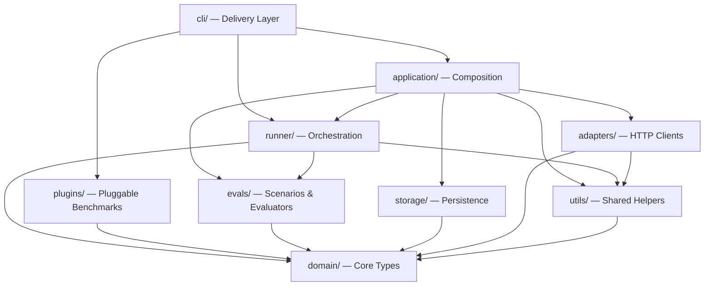

# Architecture

This document describes the internal architecture of `tool-eval-bench`.
For contributor conventions and quality bar, see [AGENTS.md](../AGENTS.md).
For adding new scenarios, see [CONTRIBUTING.md](../CONTRIBUTING.md).

---

## Layered Architecture



### Dependency Rules

| Layer | May Import | Must NOT Import |
|---|---|---|
| `domain/` | stdlib and other domain modules | storage, concrete adapters, application, runner, cli, evals |
| `evals/` | domain | storage, adapters, runner, cli |
| `runner/` | domain ports, evals, utils | storage, concrete adapters, application, cli |
| `plugins/` | domain ports | storage, concrete adapters, application, cli, runner, evals |
| `storage/` | domain | adapters, runner, cli, evals |
| `application/` | domain, evals, runner, adapters, storage, utils | cli |
| `adapters/` | domain ports, utils | storage, application, runner, cli, evals |
| `cli/` | everything (delivery layer) | — |
| `utils/` | stdlib, domain | storage, adapters, runner, cli, evals |

These rules describe first-party layer imports. Measurement runners such as
throughput, speculative decoding, and context pressure use the
`domain.measurement.MeasurementClient` port. Its HTTP adapter preserves raw
SSE lines so runners retain exact arrival timing without importing the concrete
HTTP client. Scenario orchestration continues to use the `BackendAdapter` port.
`spec_live.py` remains separate because it is a long-lived Prometheus monitor,
not a bounded benchmark measurement request.

---

## Module Reference

### Package Root

| Module | Purpose |
|---|---|
| `api.py` | The public programmatic entry point. `run_benchmark()` is the supported integration surface; see [api.md](api.md) |
| `schema.py` | Machine-readable CLI argument schema and output schema versioning |
| `__main__.py` | `python -m tool_eval_bench` entry point |
| `__init__.py` | Version resolution and a convenience re-export of `run_benchmark` |

### `domain/` — Core Types

The domain layer defines all data structures and contracts. It has zero
external dependencies.

| Module | Purpose |
|---|---|
| `adapters.py` | Backend adapter port and provider-neutral chat result/tool-call types |
| `scenarios.py` | `ScenarioDefinition`, `ScenarioEvaluation`, `ScenarioState`, `Category` enum, scoring functions, safety gating |
| `models.py` | `BenchmarkConfig` dataclass |
| `measurement.py` | `MeasurementClient` port and raw streaming response types |
| `plugin.py` | `BenchmarkPlugin` ABC + `BenchmarkResult` dataclass for pluggable benchmarks |
| `tools.py` | Universal tool definitions (12 tools), system prompt |
| `tools_large.py` | Extended 52-tool definitions for Category L |
| `errors.py` | Structured error code constants |

### `evals/` — Scenarios & Evaluators

Each scenario is one file under `evals/scenarios/<group>/tcNN.py`, holding a
self-contained `ScenarioDefinition`:
- A **user message** (the prompt)
- A **mock handler** (deterministic tool responses)
- An **evaluator** (scoring logic: pass/partial/fail)
- A `DISPLAY` entry describing its success and failure cases

A group package discovers its own `tcNN.py` files, so creating the file is the
whole registration. Helpers used by more than one scenario in a group live in
that group's `_shared.py`; they stay group-scoped because several groups define
different helpers under the same name.

| Group | Categories | Scenarios |
|---|---|---|
| `scenarios/core/` | A–E (the original 15) | TC-01 – TC-15 |
| `scenarios/extended/` | F–G | TC-16 – TC-21 |
| `scenarios/agentic/` | H–K (partial) | TC-22 – TC-50, TC-62–TC-63 |
| `scenarios/adversarial/` | K (safety extras) | TC-57 – TC-60 |
| `scenarios/large_toolset/` | L | TC-37 – TC-40 |
| `scenarios/planning/` | M–N | TC-51 – TC-56 |
| `scenarios/structured/` | O | TC-64 – TC-69 |
| `scenarios/hardmode/` | P (opt-in) | TC-70 – TC-74 |
| `scenarios/hardmode_expanded/` | P (opt-in expansion) | TC-75 – TC-84 |
| `scenarios/hardmode_transactional/` | P (transactional and reasoning continuity) | TC-85 – TC-88 |
| `packs.py` | none | Held-out YAML scenario-pack loading and content attestations |
| `helpers.py` | — | Shared evaluator utilities (datetime matching, text scanning, safe math) |
| `noise.py` | — | Deterministic payload enrichment for realistic API noise |

Registries, all built by `evals/scenarios/__init__.py`:
- `SCENARIOS` — core 15 (used by `--short`)
- `ALL_SCENARIOS` — full 69
- `ALL_SCENARIOS_WITH_HARDMODE` — full 88

The CLI's public scenario selection follows these rules:

- The default pool is the standard 69 scenarios.
- `--hardmode` adds all 19 Category P scenarios. `--hardmode-only` selects
  Category P alone.
- Explicit IDs resolve against all 88 public scenarios, so
  `--scenarios TC-85` selects a Hard Mode scenario without `--hardmode`.
  Explicit IDs take precedence over `--short` and `--categories`.
  Unknown IDs fail before model discovery.
- To select Category P by category, use `--hardmode --categories P` or
  `--hardmode-only`.
- `--scenario-pack` appends held-out scenarios, while `--pack-only` makes the
  pack the only pool. Pack IDs cannot collide with public IDs.

#### Declarative YAML scenarios (pilot)

A small set of scenarios can also be authored as YAML data files under
`evals/yaml_scenarios/`, loaded by `evals/yaml_loader.py`. This is a
low-risk pilot for a future "YAML-first" direction — simple scenarios
(declarative expected tool calls and response rules) can be written without
Python evaluator functions. The existing 88 Python scenarios are the
canonical source for now.

### `runner/` — Orchestration

| Module | Purpose |
|---|---|
| `orchestrator.py` | Multi-turn tool-call loop, with a default of 8 turns and per-scenario overrides |
| `service.py` | Compatibility re-export of the application-owned `BenchmarkService` |
| `throughput.py` | Built-in streaming pp/tg measurement |
| `speculative.py` | Spec-decode / MTP benchmarking (acceptance rate, effective t/s) |
| `spec_live.py` | Live monitor data layer (Prometheus scraping, delta computation) |
| `llama_benchy.py` | External llama-benchy subprocess integration |
| `context_pressure.py` | Filler generation, calibration, prefix-cache busting |
| `judge.py` | LLM-as-judge for failed scenario analysis (WIP) |
| `async_tools.py` | Async tool execution simulation (polling-style tools) |

### `adapters/` — HTTP Clients

| Module | Purpose |
|---|---|
| `base.py` | Compatibility re-export of the domain-owned `BackendAdapter` port and result types |
| `measurement.py` | HTTP implementation of the domain-owned measurement port, including raw SSE arrival timing |
| `openai_compat.py` | `OpenAICompatibleAdapter` — vLLM, LiteLLM, llama.cpp, SGLang, and Google's OpenAI compatibility layer |
| `gemini.py` | `GeminiAdapter` — the native Gemini `:generateContent` API |
| `http_retry.py` | Shared retry, backoff, and rate-limit pacing for both adapters |
| `wire_format.py` | Which format an endpoint speaks, detected from its URL |
| `factory.py` | `build_adapter()` — picks the adapter for a base URL / `--format` |
| `requests.py` | Minimal single-shot request bodies for pre-flight and warm-up |

The `--backend` flag is a label for reports; the request format follows the
endpoint itself, detected from the base URL unless `--format` pins it.

### `plugins/` — Pluggable Benchmarks

Each plugin implements `domain.plugin.BenchmarkPlugin` and owns its own
dataset loading, evaluation, and report rendering.

| Plugin | Dataset | Questions |
|---|---|---|
| `gsm8k/` | `openai/gsm8k` | 1,319 math reasoning |
| `mmlu/` | `cais/mmlu` | 14,042 multitask (57 subjects) |
| `ifeval/` | `google/IFEval` | 541 instruction following |

Shared infrastructure:
- `hf_utils.py` — HuggingFace downloader (retry, resume, throttle, `datasets` library fast-path)
- `registry.py` — `get_plugin()` / `available_plugins()` lookup

### `application/` — Composition

| Module | Purpose |
|---|---|
| `service.py` | `BenchmarkService` — composes concrete adapters, scenario orchestration, SQLite persistence, and Markdown reporting |
| `finalization.py` | Completes interrupted or checkpointed runs and builds the final persisted summary |

### `storage/` — Persistence

| Module | Purpose |
|---|---|
| `db.py` | `RunRepository` — SQLite persistence for run results |
| `reports.py` | `MarkdownReporter` — generates `runs/YYYY/MM/<run_id>.md` reports |

### `cli/` — Delivery Layer

| Module | Purpose |
|---|---|
| `bench.py` | Thin CLI entry point and compatibility re-export shell |
| `command_registry.py` | Discoverable subcommand metadata and translation rules |
| `parser.py` | Subcommand discovery and translation into the legacy runtime namespace |
| `legacy_parser.py` | Permanent flat-flag parser used by legacy invocations and translated subcommands |
| `dispatch.py` | Runtime command routing and tool-call benchmark flow |
| `compare_report.py` | HTML comparison command for Markdown reports |
| `local_commands.py` | Dry-run and local command rendering |
| `model_probe.py` | Model discovery and availability probing |
| `plugin_runners.py` | Shared persistence/progress lifecycle and plugin-specific execution |
| `plugin_lifecycle.py` | Shared plugin run lifecycle and result persistence |
| `probe.py` | Model/server detection, preflight checks, and warmup |
| `commands.py` | Scenario resolution (`resolve_scenarios`, `resolve_all_scenarios_for_ids`) |
| `resolve.py` | Compatibility exports for scenario/sweep resolution helpers |
| `run_io.py` | Trial aggregation and JSON/progress output helpers |
| `helpers.py` | Small CLI helpers: dotenv loading, URL redaction, JSON output, sweep/int parsing, plugin-run persistence, headless errors |
| `server.py` | Server discovery and backend detection from response headers (`discover_server`, `detect_backend_from_response`) |
| `perf.py` | Throughput runners: `run_throughput` (built-in), `run_llama_benchy` (external) |
| `spec_bench.py` | Speculative-decoding / MTP benchmark runner |
| `pressure.py` | Context-pressure sweep runner |
| `display.py` | Zero-flicker streaming Rich display for scenario progress |
| `history.py` | `--history`, `--compare`, `--diff` rendering |
| `leaderboard.py` | `--leaderboard`, `--export` rendering |
| `spec_live_display.py` | Live spec-decode Textual dashboard |
| `spec_live_rendering.py` | Rich component rendering for spec-live |

### `compare_reports/` Report comparisons

| Module | Purpose |
|---|---|
| `summary.py` | Compare summary-style reports |
| `tool_eval.py` | Compare tool-evaluation reports and scenario traces |

### `utils/` — Shared Helpers

| Module | Purpose |
|---|---|
| `ids.py` | Unique run IDs and deterministic configuration fingerprints |
| `metadata.py` | System/backend metadata collection (engine probing) |
| `openai_compat.py` | OpenAI-compatible request and response helpers |
| `tokenizers.py` | Local tokenizer discovery for throughput prompts |
| `urls.py` | URL construction, redaction, header helpers |

---

## Data Flow

### Tool-Call Benchmark

```
CLI
  │
  ├─ parse args → BenchmarkConfig
  ├─ create application.BenchmarkService(repo, reporter)
  │
  └─ service.run_benchmark()
       │
       ├─ build the adapter selected by the endpoint wire format
       ├─ for each scenario in resolved list:
       │    │
       │    ├─ orchestrator.run_scenario(scenario, adapter, config)
       │    │    │
       │    │    ├─ build messages: system + context + user + [pressure filler]
       │    │    ├─ loop (up to configured max_turns, with scenario overrides):
       │    │    │    ├─ adapter.chat_completion(messages, tools)
       │    │    │    ├─ if tool_calls: execute via scenario.handle_tool_call()
       │    │    │    ├─ noise.enrich_payload(result)
       │    │    │    └─ append tool results to messages
       │    │    │
       │    │    └─ scenario.evaluate(state) → ScenarioEvaluation
       │    │
       │    └─ yield ScenarioResult
       │
       ├─ compute scores (scenario-count-weighted)
       ├─ apply safety gate (Category K < 50% → cap rating)
       │
       ├─ pass scenario metadata to reporter through domain types
       ├─ reporter.write(run)      # Markdown must succeed first
       └─ repo.save(run)           # then store completed SQLite row
```

### Plugin Benchmark (GSM8K/MMLU/IFEval)

```
CLI
  │
  ├─ registry.get_plugin("gsm8k")
  ├─ plugin.run(adapter, config)
  │    │
  │    ├─ dataset.load()           # HF datasets lib or REST API
  │    ├─ for each question:
  │    │    ├─ build few-shot prompt
  │    │    ├─ adapter.chat_completion(messages)
  │    │    ├─ evaluator.extract_answer(response)
  │    │    └─ evaluator.check(extracted, expected)
  │    │
  │    └─ BenchmarkResult(accuracy, breakdown, ...)
  │
  └─ render report (terminal + Markdown)
```

---

## Extension Points

### Adding a New Scenario
See [CONTRIBUTING.md](../CONTRIBUTING.md#adding-a-new-scenario).

### Adding a New Plugin Benchmark
1. Create `plugins/<name>/` with `dataset.py`, `evaluator.py`, `plugin.py`
2. Implement `BenchmarkPlugin` from `domain/plugin.py` using the backend port in `domain/adapters.py`
3. Register in `plugins/registry.py`
4. Add CLI flags in `cli/legacy_parser.py` and register them in `schema.py`
5. Add the subcommand metadata and flag translation rules in `cli/command_registry.py`, or the
   plugin gets a legacy flat flag and no `plugin <name>` subcommand
6. Wire the run path in `cli/plugin_runners.py` and the finalization path in
   `cli/plugin_lifecycle.py`
7. Regenerate the committed compatibility snapshots with `scripts/update_compat_snapshots.py`

### Adding a New Backend
OpenAI-compatible backends use `OpenAICompatibleAdapter`. To support a new backend:
1. Ensure it exposes `/v1/chat/completions` with `tools` support
2. Add a port to auto-discovery in `cli/server.py`
3. Add the backend label to `application/service.py` and backend detection mappings

For a native wire format, add a provider adapter and register it through
`adapters/factory.py` and `adapters/wire_format.py` instead.

---

## Test Architecture

| Layer | Test Files | Count |
|---|---|---|
| Evaluator contract | `test_evaluator_contract.py` | Golden-trace PASS/FAIL/PARTIAL for TC-01–TC-15 |
| Evaluator coverage | `test_evaluators_extended.py`, `test_hardmode.py`, `test_hardmode_expanded.py`, `test_hardmode_transactional.py`, `test_structured_output.py`, `test_planning_scenarios.py` | Extended scenarios F through P |
| Evaluator robustness | `test_evaluator_robustness.py` | Crash resistance, edge cases |
| Plugin evaluators | `test_gsm8k_evaluator.py`, `test_mmlu_evaluator.py`, `test_ifeval_checkers.py` | Answer extraction, constraint checking |
| Runner | `test_orchestrator.py`, `test_throughput.py`, `test_speculative.py`, `test_spec_live.py` | Orchestration, measurement |
| Storage | `test_reporter.py`, `test_history.py`, `test_storage_metadata.py` | Persistence, reports |
| CLI | `test_display.py`, `test_leaderboard_display.py`, `test_e2e.py` | Display rendering, E2E flows |
| API | `test_api.py`, `test_plugin_interface.py` | Programmatic API, schema drift |
| Adapter | `test_adapter.py` | SSE streaming, normalize, parse, error handling (httpx mocks) |

The authoritative test count and branch-coverage result come from the current
CI run; avoid copying those fast-changing values into architecture docs.
